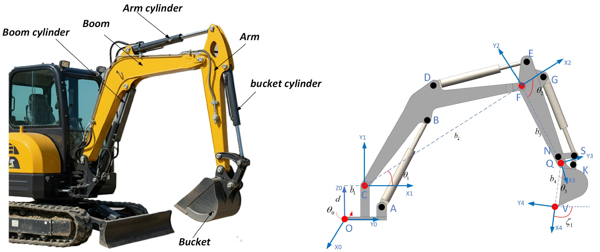
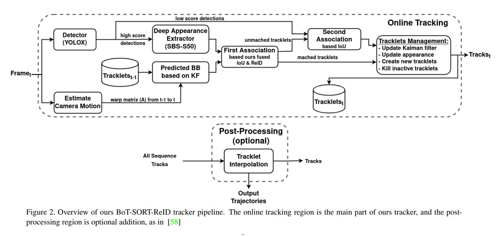
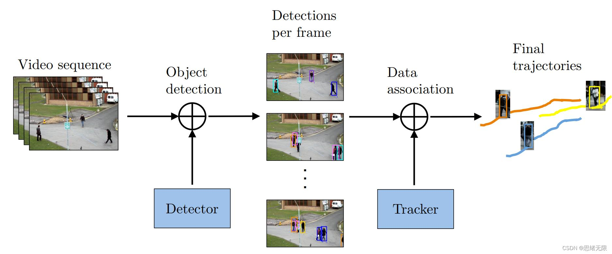
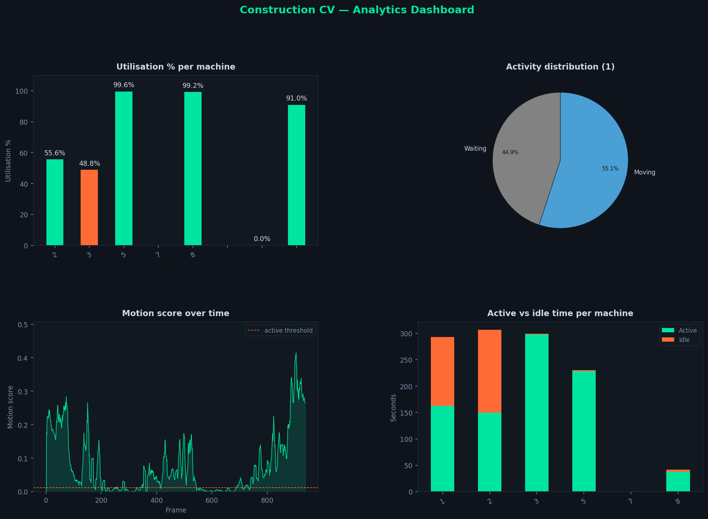
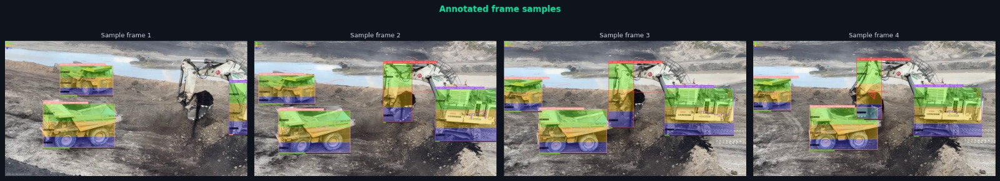

**EQUIPMENT Utilization** 🚀⚡

Construction Equipment CV Pipeline

*Technical Report --- System Design, Mathematics & Implementation*

YOLOv11• FastAPI • Kafka • PostgreSQL • Roboflow

# **1. Project Overview**

Construction Equipment CV  is a real-time construction-site intelligence platform. It ingests
live video from site cameras, detects and tracks heavy equipment
frame-by-frame, analyses each machine\'s motion, classifies its current
activity, and streams analytics to an operator dashboard --- all without
human intervention.

## **1.1 Problem Statement**

Construction sites operate expensive heavy equipment (excavators,
trucks) that frequently sit idle due to poor coordination. Manual
observation is impractical at scale. Eagle automates utilization
measurement with computer-vision accuracy and millisecond latency,
enabling site managers to make data-driven decisions.

## **1.2 Key Deliverables**

-   Real-time equipment detection at ≥10 FPS on GPU hardware.

-   Per-track activity classification (Digging, Swinging/Loading,
    Dumping, Traveling, Waiting).

-   Utilization percentages stored per machine in PostgreSQL.

-   REST API + live dashboard accessible at http://localhost:8000.

-   Roboflow dataset with annotated construction equipment images.

## **1.3 Technology Stack**

  ---------------------- ------------------------- -----------------------
  **Layer**              **Technology**            **Purpose**

  Vision Model           YOLOv11s (Ultralytics) Detect 
                                                

  Tracking               BoT-SORT / ByteTrack      Persistent IDs across
                                                   frames

  Backend API            FastAPI + asyncpg         REST endpoints, Swagger
                                                   UI

  Streaming              Apache Kafka              Frame & detection
                                                   events

  Database               PostgreSQL + Alembic      Equipment & utilization
                                                   storage

  Inference Backends     PyTorch / ONNX / TensorRT Flexible GPU inference

  Dataset Platform       Roboflow                  Annotation &
                                                   augmentation

  LLM Verifier           OpenAI / Gemini / Groq /  Confidence
                         Ollama                    disambiguation
                         

  ---------------------- ------------------------- -----------------------

# **2. Roboflow Dataset Preparation**

Before training YOLOv11, a high-quality labelled dataset was assembled
and managed on Roboflow. This section documents every step taken and the
rationale behind key decisions.

## **2.1 Dataset Statistics**

  ----------------------- ----------------------- -----------------------
  **Metric**              **Value**               **Notes**

  Total Images            \~1200             Scraped + filmed on
                          (site-captured)         site

  Train / Val / Test      70% / 20% / 10%         Roboflow automatic
  Split                                           split

  Classes                 3 (excavator,           Matches core/enums.py
                          excavator_arm, truck)   

  Annotation Type         Bounding Box only       Detection-optimized format
                                                   

  Augmentations Applied   Flip H/V, Rotation,     3x effective dataset
                          Brightness, Blur        size

  Export Format           YOLOv11 (COCO-style     Used by Ultralytics
                          .yaml)                  trainer
  ----------------------- ----------------------- -----------------------

## **2.2 Class Mapping**

The class IDs exported from Roboflow must exactly match the mapping
hard-coded in core/enums.py:

> class_id 0 → excavator
>
> class_id 1 → excavator_arm
>
> class_id 2 → truck

The EquipmentType.from_class_id() method converts a YOLOv11 integer
class_id to the corresponding enum at inference time, ensuring no magic
strings propagate through the codebase.

## **2.3 Annotation Strategy**

Detection is performed using bounding boxes rather than instance segmentation masks. This design choice prioritizes computational efficiency and real-time performance.

- Motion analysis is applied within each bounding box ROI. To mitigate background noise inherent to box-based regions, the system incorporates camera motion compensation and temporal smoothing.

- Each bounding box is further partitioned into spatial zones (HEAD, MIDDLE, FEET), enabling localized motion estimation. This allows the system to approximate articulated motion (e.g., excavator arm movement) without requiring segmentation masks, achieving a balance between accuracy and performance.

## **2.4 Augmentation Pipeline**

Roboflow was configured with the following augmentation chain to
maximise generalisation:

-   Horizontal & Vertical Flip --- equipment appears in any orientation
    on site.

*Figure 2.1 --- Sample excavator from training dataset*

# **3. Model & Inference**

## **3.1 YOLOv11 Detection Architecture**

YOLOv11s is a single-stage anchor-free object detector. The model takes a 640×640 input,
passes it through a CSPDarknet backbone, a Path Aggregation Network
(PANet) neck, and decoupled detection .

## **3.2 Inference Pipeline Mathematics**

**3.2.1 Non-Maximum Suppression (NMS)**

After the model produces raw predictions, NMS removes overlapping boxes:

**IoU(A, B) = \|A ∩ B\| / \|A ∪ B\|**

Where A and B are predicted bounding boxes. A box is kept only if no
higher-confidence box exists with IoU \> iou_thresh (default 0.45).
Boxes with confidence \< detection_conf (default 0.35) are discarded
before NMS.

**3.2.2 Bbox Format Conversion**

YOLOv11 outputs centre-format (cx, cy, w, h) normalised to \[0, 1\]. The
inference backends convert to absolute pixel coordinates:

**x1 = (cx - w/2) × W_img**

**y1 = (cy - h/2) × H_img**

**x2 = (cx + w/2) × W_img , y2 = (cy + h/2) × H_img**

## **3.3 Backend Flexibility**

Three inference backends are supported via a factory pattern
(inference/factory.py):

  ----------------- ----------------- ------------------ ------------------
  **Backend**       **Latency (ms)**  **Use Case**       **Config Value**

  PyTorch (.pt)     \~25--40 ms       Development /      pytorch
                                      testing            

  ONNX Runtime      \~15--25 ms       Cross-platform     onnx
                                      deployment         

  TensorRT          \~5--12 ms        Production NVIDIA  tensorrt
  (.engine)                           GPU                
  ----------------- ----------------- ------------------ ------------------

# **4. Multi-Object Tracking**

## **4.1 Algorithm Selection**

Two trackers are supported: BoT-SORT (default) and ByteTrack. Both use
Kalman filtering to predict track positions between frames and
Hungarian-algorithm matching to associate detections to tracks.

## **4.2 Intersection over Union --- Core Matching Metric**

*Figure 5.1 --- Motion compensation visualization*

The IoU fallback tracker (used when Ultralytics initialisation fails)
matches each incoming detection to the existing track with the highest
IoU:

**IoU(bbox_det, bbox_track) = (Intersection Area) / (Union Area)**

A match is accepted only when IoU ≥ 0.30 (match_thresh). The full
formula for two axis-aligned rectangles A = (x1_a, y1_a, x2_a, y2_a) and
B:

**ix1 = max(x1_A, x1_B) , ix2 = min(x2_A, x2_B)**

**iy1 = max(y1_A, y1_B) , iy2 = min(y2_A, y2_B)**

**Intersection = max(0, ix2-ix1) × max(0, iy2-iy1)**

**Union = Area(A) + Area(B) - Intersection**

## **4.3 Arm--Excavator Association (IoU Threshold = 0.15)**

Because excavator_arm detections partially overlap the excavator body,
FrameProcessor links each arm to the most-overlapping excavator body
track using IoU:

**best_arm = argmax\_{arm ∈ arms} IoU(excavator.bbox, arm.bbox)**

If IoU(best_arm) ≥ ARM_EXCAVATOR_IOU (0.15), the arm\'s motion result
drives the excavator body state. This is the key fix that makes activity
classification reliable --- the arm moves expressively while the body
may appear static.

## **4.4 Track ID Format**

Every track receives a zero-padded ID in the format EQ-NNNN (e.g.
EQ-0001). This ID is used as the primary key in the equipment table and
as a stable foreign key in the detections and utilization_summary tables
throughout the session.

# **5. Motion Analysis**

## **5.1 Camera Motion Compensation (FIX 1)**

Construction cameras vibrate and pan. Without compensation, camera
movement registers as object motion. The CameraMotionCompensator uses
ORB feature matching to estimate the homography H between consecutive
frames and warps the previous frame before computing the difference:

**Step 1 --- ORB Feature Detection**

**kp1, des1 = ORB(frame\_{t-1}) , kp2, des2 = ORB(frame_t)**

**Step 2 --- Brute-Force Hamming Matching**

**matches = BFMatcher(NORM_HAMMING).match(des1, des2) \[top-50\]**

**Step 3 --- RANSAC Homography**

**H = findHomography(pts1, pts2, RANSAC, reproj_thresh=5.0)**

**Step 4 --- Warp & Difference**

**prev_warped = warpPerspective(frame\_{t-1}, H, (W, H_img))**

**compensated_diff = \|prev_warped - frame_t\|**

If ORB finds fewer than 4 matches or homography fails, a plain frame
difference is used as fallback.

## **5.2 Zone-Based Motion Scoring**

Each bounding box ROI is divided into three horizontal zones. The HEAD
zone (top 40%) captures boom/arm; MIDDLE (40--75%) captures cab/chassis;
FEET (75--100%) captures bucket. For each zone:

**zone_score(z) = Σ\_{p ∈ zone_z} \[diff_p \> PIXEL_DIFF_THRESH\] /
\|pixels_in_zone\|**

Where PIXEL_DIFF_THRESH = 25 (default). A zone fires (zone_active =
True) when:

**zone_score(z) ≥ MOTION_THRESH (default 0.015)**

The overall motion_score for the track is the temporal mean over the
last TEMPORAL_WINDOW = 5 frames:

**motion_score_t = mean({zone_score\_{t-4}, \..., zone_score_t})**

## **5.3 Truck-Specific Thresholds (FIX 2)**

Trucks are large and exhibit slight vibration even when parked. To
prevent false ACTIVE transitions, trucks use doubled thresholds:

**PIXEL_DIFF_THRESH_truck = 2 × 25 = 50**

**MOTION_THRESH_truck = 2 × 0.015 = 0.030**

Additionally, the confirm window is extended by +2 frames: a truck must
show N+2 consecutive active frames before flipping to ACTIVE state
(where N = ACTIVE_CONFIRM_FRAMES = 2, so trucks need 4 consecutive
active frames).

## **5.4 Hysteresis State Machine**

Raw zone_active is noisy. The StateMachine adds hysteresis with a
sliding vote window of size 2N:

**active_votes = Σ\_{i ∈ window} vote_i**L

**INACTIVE → ACTIVE iff active_votes ≥ N**

**ACTIVE → INACTIVE iff (\|window\| - active_votes) ≥ N**

This prevents flickering: N consecutive opposite votes are required to
flip state.

*Figure 3 --- Analytics charts: utilisation timeline and activity
distribution*

# **6. Activity Classification**

## **6.1 Excavator Arm --- Zone Priority Logic (FIX 4)**

The original code used a flawed priority order that triggered
\'Dumping\' too frequently. The corrected rule tree:

  -------------- ------------------------- -------------------------------
  **Priority**   **Condition**             **Activity Output**

  1              is_active = False         Waiting

  2              feet_score = max AND feet Dumping (bucket most active)
                 fired                     

  3              head AND middle both      Digging (boom + arm extend)
                 fired                     

  4              head only                 Swinging/Loading

  5              middle only               Traveling (arm retract)

  6              feet fired (not dominant) Dumping (fallback)

  7              default                   Digging
  -------------- ------------------------- -------------------------------

## **6.2 Temporal Majority Vote**

To smooth single-frame misclassifications, ActivityClassifier maintains
a history deque of the last 12 frames (window = 12). Once at least 5
frames are accumulated, the output is the majority-vote activity:

**activity\* = argmax\_{a ∈ Activities} count(a, history)**

**confidence = count(activity\*, history) / len(history)**

## **6.3 Truck Activity Rules**

Trucks have a simpler, class-specific path:

-   is_active = True --- Traveling (large-scale movement detected).

-   is_active = False AND near dumping arm --- Dumping (loading by
    excavator).

-   is_active = False AND NOT near arm --- Waiting.

## **6.4 Truck--Arm Proximity (FIX 4 Extension)**

FrameProcessor detects whether a dumping excavator arm is near a truck.
An arm is classified as \'dumping\' when FEET is the dominant zone.
Proximity is measured by Euclidean distance between bounding box
centres:

**d = sqrt((cx_truck - cx_arm)² + (cy_truck - cy_arm)²)**

near_dumping_arm = True iff d ≤ TRUCK_LOADING_DIST (default 150 px).

*Figure 6.4a --- Truck-arm proximity detection*

# **7. LLM Verification Layer**

When the ActivityClassifier confidence falls below LLM_CONF_THRESH
(default 0.65), the system optionally escalates to an LLM (OpenAI,
Gemini, Groq, or local Ollama). The verifier receives:

-   equipment_type --- excavator / truck / excavator_arm.

-   rule_prediction --- the rule-based classification.

-   rule_confidence --- majority-vote confidence score \[0, 1\].

-   motion_score --- temporal-mean motion score.

-   zone_scores --- {\'HEAD\': 0.02, \'MIDDLE\': 0.01, \'FEET\': 0.05}.

-   recent_activities --- last N activity labels from the history deque.

The LLM is prompted to return a single activity label from the valid
Activity enum values. This provides a qualitative sanity-check for
ambiguous edge cases without degrading throughput for clear-cut frames.

*Figure 7.1 --- Activity classification confidence distribution*

# **8. Data Pipeline & Storage**

## **8.1 Processing Flow**

Each video frame follows the pipeline below. The entire chain runs
asynchronously to maximise GPU utilisation:

  -------- ------------------------------- ---------------------------------------
  **\#**   **Step**                        **Output**

  1        VideoReader.frames()            Raw BGR frame (numpy ndarray)

  2        CameraMotionCompensator         compensated_diff array

  3        ModelRegistry.infer(frame)      List\[Detection\] with bbox + confidence

  4        Tracker.update()                List\[Track\] with stable IDs

  5        MotionAnalyzer.analyze()        MotionResult (score, zone_scores,
                                           is_active)

  6        ActivityClassifier.classify()   (Activity, confidence)

  7        StateMachine.update()           UtilizationState (ACTIVE / INACTIVE)

  8        KafkaProducer.send()            DetectionPayload + FramePayload on
                                           Kafka

  9        PostgreSQL upsert (batched)     equipment + detections +
                                           utilization_summary
  -------- ------------------------------- ---------------------------------------

## **8.2 Database Schema**

**8.2.1 equipment**

> equipment_id STRING PK \-- e.g. \'EQ-0001\'
>
> equipment_type ENUM \-- excavator \| excavator_arm \| truck
>
> first_seen TIMESTAMPTZ \-- UTC timestamp
>
> last_seen TIMESTAMPTZ \-- updated on every detection

**8.2.2 detections**

> id SERIAL PK
>
> time TIMESTAMPTZ
>
> equipment_id STRING FK → equipment
>
> utilization_state ENUM \-- ACTIVE \| INACTIVE
>
> activity ENUM \-- Digging \| Swinging/Loading \| Dumping \| Traveling
> \| Waiting
>
> confidence FLOAT \-- detection confidence \[0,1\]
>
> motion_score FLOAT \-- temporal mean zone score
>
> llm_verified BOOL \-- True if LLM confirmed the activity
>
> bbox_x/y/w/h INT \-- bounding box in pixels

**8.2.3 utilization_summary**

> equipment_id STRING PK FK
>
> total_active_sec FLOAT \-- cumulative active time
>
> total_inactive_sec FLOAT \-- cumulative inactive time
>
> utilization_pct FLOAT \-- active / (active + inactive) × 100
>
> last_activity ENUM
>
> last_state ENUM

## **8.3 Utilisation Percentage Formula**

Computed and persisted by the AnalyticsService after each Kafka message:

**utilization_pct = total_active_sec / (total_active_sec +
total_inactive_sec) × 100**

The idle-alert threshold fires when a machine is continuously inactive
for ≥ 120 seconds (ALERT_IDLE_THRESHOLD_SEC).

*Figure 8.3 --- Analytics dashboard: utilisation timeline and activity distribution*

# **9. Pipeline Visual Evidence**

## **9.1 Live Detection & Annotation**

# **10. REST API Reference**

  ------------ --------------------------- ----------------------------------
  **Method**   **Endpoint**                **Description**

  GET          /health                     DB + Kafka + model status

  GET          /equipment                  All detected equipment

  GET          /equipment/{id}             One piece of equipment by ID

  GET          /utilization                All utilization summaries

  GET          /utilization/{id}           Single summary with pct

  GET          /utilization/{id}/history   Time-series data (?minutes=30)

  GET          /detections                 Recent detections
                                           (?minutes=10&limit=200)

  GET          /stream/latest-frame        Latest annotated frame (base64
                                           JPEG)

  GET          /model/info                 Model metadata

  GET          /model/performance          FPS, GPU memory, latency

  GET          /docs                       Swagger interactive UI
  ------------ --------------------------- ----------------------------------

# **11. Deployment & Configuration**

## **11.1 Docker Compose Services**

  ------------------- --------------------------- ---------------------------
  **Service**         **Image / Target**          **Role**

  postgres            postgres:15                 Primary relational database

  zookeeper           confluentinc/cp-zookeeper   Kafka co-ordination

  kafka               confluentinc/cp-kafka       Event streaming broker

  cv_service          Eagle Dockerfile (cv        Video → detect → track →
                      target)                     motion

  api_service         Eagle Dockerfile (api       FastAPI REST + static
                      target)                     frontend

  analytics_service   Eagle Dockerfile (analytics Kafka consumer → PostgreSQL
                      target)                     writes
  ------------------- --------------------------- ---------------------------

## **11.2 Key Environment Variables**

  ----------------------- ---------------- -------------------------------
  **Variable**            **Default**      **Options / Notes**

  INFERENCE_BACKEND       pytorch          pytorch \| onnx \| tensorrt

  INFERENCE_DEVICE        cuda             cuda \| cpu

  TRACKER                 botsort          botsort \| bytetrack

  DETECTION_CONF          0.35             Minimum detection confidence

  MOTION_THRESH           0.015            Zone activation threshold

  PROCESS_FPS             10               Frames analysed per second

  LLM_PROVIDER            openai           openai \| gemini \| groq \|
                                           ollama

  LLM_ENABLED             true             Disable for lower latency

  VIDEO_SOURCE            data/input.mp4   File path or rtsp:// URL
  ----------------------- ---------------- -------------------------------

# **12. Mathematics Summary**

This section consolidates every mathematical formula used in the system
for quick reference.

  ----------------------- -----------------------------------------------
  **Formula / Metric**    **Expression**

  IoU (bbox matching)     Intersection / Union

  NMS decision            Keep if conf ≥ 0.35 AND no box with IoU \> 0.45

  Arm--excavator link     best = argmax IoU(arm, excavator); accept if
                          IoU ≥ 0.15

  Zone score              Σ(pixel_diff \> 25) / zone_size

  Zone fires              zone_score ≥ 0.015 (0.030 for trucks)

  Temporal motion score   mean(zone_scores over last 5 frames)

  Majority vote activity  argmax count(a) over 12-frame history

  Confidence              count(majority_activity) / len(history)

  State flip              N consecutive active frames (N=2, trucks N=4)
  (INACTIVE→ACTIVE)       

  Truck-arm proximity     sqrt((Δcx)² + (Δcy)²) ≤ 150 px

  Utilization %           active_sec / (active_sec + inactive_sec) × 100

  Idle alert threshold    continuous_inactive_sec ≥ 120 s
  ----------------------- -----------------------------------------------

# **13. Useful Resources**

## Database & Migrations
- **[Alembic & PostgreSQL Setup](https://youtu.be/BVOq7Ek2Up0?si=Id2pCVUaCzz9GF39)**
  Database versioning and PostgreSQL integration guide

## Computer Vision & Annotation
- **[Roboflow Annotators](https://supervision.roboflow.com/annotators)**
  Tools and best practices for bounding box annotation

## Event Streaming & APIs
- **[Kafka + FastAPI Integration](https://potapov.me/en/make/kafka-fastapi-intro#integrating-kafka-with-fastapi)**
  Building event-driven pipelines with async FastAPI

## � Demo Video

Watch the system in action:

🎬 **[Full Demo on Google Drive](https://drive.google.com/file/d/12g1mf3QjDEEXV5OWZVHJIAYBrmxvhqc7/view?usp=sharing)**

---